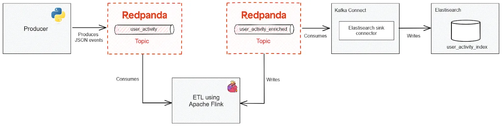

# Redpanda - Flink - Elasticsearch - Kafka-connect


## About <a name = "about"></a>

Source: [link](https://redpanda-data.medium.com/build-a-lightning-fast-search-index-using-flink-elasticsearch-and-redpanda-60cfce9c5939)

## Getting Started <a name = "getting_started"></a>

This is a tutorial on How to use repanda (Kafka Alternative) and flink to index data in Elasticsearch using Kakfa-connect.

Below is the flowchart



### Prerequisites

What things you need to install the software and how to install them.

```
pip3 install -r requirements.txt
```

Download Elasticsearch Sink Connector from the below link:

[Elasticsearch Sink Connector](https://www.confluent.io/hub/confluentinc/kafka-connect-elasticsearch)

Copy the content of this Sink connect into `plugins` directory, such that the below `lib` directory matches the volume below:
```yaml
volumes:
  - ./plugins/confluentinc-kafka-connect-elasticsearch-14.0.17/lib:/etc/kafka-connect/jars
```

### Installing

We first need to build the Apache Flink images:

```
docker-compose build --no-cache
```


Then we can start the containers using docker compose:
```
docker compose up -d
```

To Shutdown all the containers (**Only when you are finish with the project, as it will destroy all the containers**):

```
docker compose down
```

End with an example of getting some data out of the system or using it for a little demo.

## Usage <a name = "usage"></a>

First, let's create out topics on the below link to Redpanda console:
- http://localhost:8080/topics


Run the below after the containers are up to push data to Redpanda:
```bash
python main.py
```

Then, run the below in open a Flink SQL console:
```bash
docker compose run sql-client
```

Then execute the below commands, one a time in the Flink SLQ console to submit the flink jobs:
```sql
SET
  'pipeline.name' = 'user-activity-processing';

-- Create raw event tables from topic "user_activity"
CREATE TABLE useractivity (
  id VARCHAR,
  activity_type VARCHAR,
  ts TIMESTAMP(3)
) WITH (
  'connector' = 'kafka',
  'topic' = 'user_activity',
  'properties.bootstrap.servers' = 'redpanda-0:9092',
  'properties.group.id' = 'test-group',
  'properties.auto.offset.reset' = 'earliest',
  'format' = 'json'
);

-- Create destination event table to topic "user_activity_enriched"
CREATE TABLE useractivity_enriched WITH (
  'connector' = 'kafka',
  'topic' = 'user_activity_enriched',
  'properties.bootstrap.servers' = 'redpanda-0:9092',
  'format' = 'json'
) AS
SELECT
  id,
  UPPER(activity_type) AS activity_type_upper,
  ts,
  'contant_mike' AS contant_mike
FROM
  useractivity;
```

Finally, run the below bash to initialize the Elasticsearch Sink Kakfa-connect connector
```bash
curl -i -X PUT -H  "Content-Type:application/json" \
            http://localhost:8083/connectors/elasticsearch-sink/config \
            -d '{"name": "elasticsearch-sink", 
"connector.class": "io.confluent.connect.elasticsearch.ElasticsearchSinkConnector",
"connection.url": "http://elastic-1:9200", 
"topics": "user_activity_enriched", 
"tasks.max": "1", 
"type.name": "_doc",
"key.ignore": "true", 
"key.converter.schemas.enable": "false",
"value.converter.schemas.enable": "false",
"schema.ignore":"true",
"key.converter": "org.apache.kafka.connect.storage.StringConverter",
"value.converter": "org.apache.kafka.connect.json.JsonConverter"
}'
```


## Dashboards

Repanda Console: http://localhost:8080

Elactisearch: http://localhost:9200

Flink Dashboard: http://localhost:8081

Kafka connector status: http://localhost:8083/connectors/elasticsearch-sink/status
